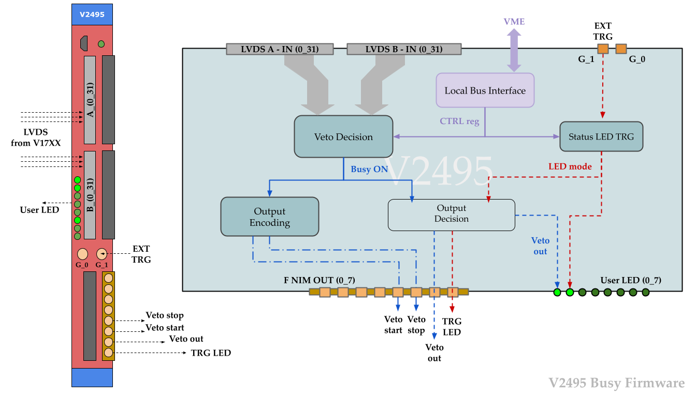

## Firmware for CAEN V2495 General Purpose Module

A.Elykov (AlexElykov@yahoo.com)

### Description:
Custom firmware for the UFPGA on the CAEN V2495 general purpose board.

### Prerequisites:
- Altera Quartus II 13.0 (web/full edition) or higher
- Cyclone V FPGA has to be supported
- Note: to be able to compile this on the free web version, might need to disable the SignalTap logic analyser in Assignments - Settings - SignalTap II
- To run AlteraModelsim on linux need to install at least the following: sudo apt-get install lib32ncurses5 lib32z1 libxft2:i386  
- Detailed instructions on setting up AlteraModelsim package installation and more are here: [LINK](http://javierd.github.io/degree/ModelSim%20Linux%20installation.html)

### Architecture: 
This is a generic busy firmware for the V2495 module and it can be easily expanded for other usages.

##### Main changes from the V1495 firmware
- Use of VHDL native libraries
- The firmware is less bloated, uses separate entities not components
- User defined registers implemented in the V2495_pkg not in the HAL, and can be accessed via the VME bus interface
- Veto duration and TRG LED waiting window set via registers
- Does not have the XENON1T/nT High Energy Veto input support
- Added ModelSim testbench for firmware simulation 

### Content:
* README.md (this file)
* firmware\src
* firmware\
* .rpd – compiled firmware file

